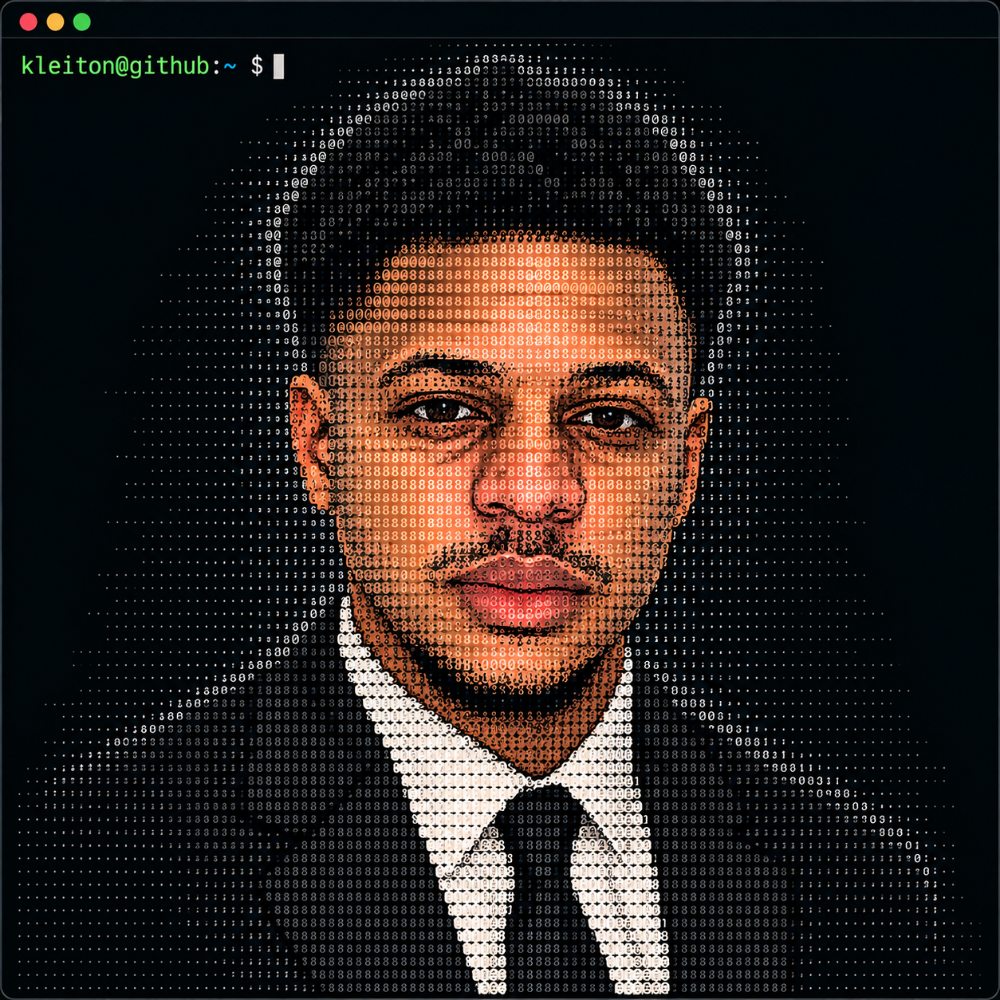

<table>
  <tr>
    <td width="46%" valign="top">
      
    </td>
    <td width="54%" valign="top">
      <h2>Olá, eu sou Kleiton 👋🏽</h2>
      
<strong>Mobile Developer | Full Stack Developer</strong>

      
Transformo ideias em produtos digitais completos — da experiência mobile à API, banco de dados e infraestrutura.

      
Minha principal stack é <strong>React Native, Expo, React, TypeScript, Node.js, NestJS e PostgreSQL</strong>.

      
Tenho experiência prática com autenticação, geolocalização, mapas, comunicação em tempo real, pagamentos, APIs REST e deploy em produção.

      
📍 Serra, Espírito Santo — Brasil

      
🎯 Aberto a oportunidades em desenvolvimento Mobile, React Native e Full Stack.

    </td>
  </tr>
</table>

  
  
  

Perfil profissional

Minha experiência está concentrada no desenvolvimento de aplicações Mobile e Web Full Stack, participando de diferentes etapas do ciclo de desenvolvimento:

Desenvolvimento mobile com React Native, Expo e TypeScript

Desenvolvimento Front-End com React e Next.js

Construção de APIs com Node.js, Express e NestJS

Modelagem e integração com PostgreSQL, MongoDB e MySQL

Autenticação e autorização utilizando JWT e OAuth

Gerenciamento de estado e comunicação cliente-servidor

Integração com APIs e serviços externos

Comunicação em tempo real utilizando Socket.IO

Geolocalização, mapas e rotas com Mapbox

Integração de fluxos de pagamento e webhooks

Containerização com Docker

Deploy e manutenção de aplicações em produção

Tenho interesse especial em projetos que exigem integração entre mobile, backend, dados e serviços em tempo real.

Experiência técnica

Mobile Development

Minha principal área de atuação atualmente é o desenvolvimento de aplicações mobile com React Native e Expo.

Área

Tecnologias

Core

React Native, Expo, TypeScript

Navegação

Expo Router, React Navigation, Deep Linking

Estado e dados

React Query, Zustand

Formulários

React Hook Form, Zod

Autenticação

JWT, OAuth, Secure Storage

Realtime

Socket.IO, WebSockets

Notificações

Expo Notifications, Firebase

Mapas

Mapbox, Geolocation

Build

EAS Build, Android, iOS

Experiência prática

Desenvolvimento de aplicações com múltiplos perfis de usuário, autenticação persistente, rotas protegidas, localização em tempo real, mapas interativos, comunicação via WebSocket, notificações, integração com backend e APIs externas.

Front-End

Principais tecnologias

React · Next.js · TypeScript · JavaScript · Tailwind CSS · Styled Components · Vite

Experiência com componentização, gerenciamento de estado, consumo de APIs, formulários, autenticação, dashboards, interfaces responsivas e integração completa com backend.

Back-End

Principais tecnologias

Node.js · NestJS · Express · TypeScript · REST APIs · Socket.IO · JWT · OAuth

Experiência na construção de APIs, autenticação, autorização, regras de negócio, comunicação em tempo real, integrações externas, webhooks e organização modular de aplicações.

Banco de Dados

Tecnologias

PostgreSQL · PostGIS · MongoDB · MySQL · Prisma ORM

Experiência com modelagem de dados, relacionamentos, consultas, migrations e integração de bancos relacionais e NoSQL com aplicações backend.

DevOps e ferramentas

Docker · Git · GitHub · Vercel · Render · Postman · Figma · VS Code

Projetos selecionados

PinkTour — Mobile Full Stack

Aplicação de mobilidade para passageiras e motoristas

A PinkTour é o projeto em que concentro atualmente grande parte do meu desenvolvimento Mobile e Full Stack.

A plataforma possui aplicações mobile independentes para passageiras e motoristas, integradas a um backend responsável por corridas, localização, pagamentos, comunicação em tempo real e regras de negócio.

Minha atuação no projeto inclui:

Arquitetura das aplicações mobile

Desenvolvimento com React Native e Expo

Navegação utilizando Expo Router

Gerenciamento de estado e dados

Integração Mobile ↔ API

Autenticação JWT e refresh token

Geolocalização

Mapas e rotas utilizando Mapbox

Atualização de localização de corridas

Comunicação em tempo real com Socket.IO

Solicitação e gerenciamento de corridas

Chat entre passageira e motorista

Push notifications

Integração de pagamentos

Processamento de webhooks

Upload e gerenciamento de documentos

Recursos de segurança e compartilhamento de viagem

Backend modular com NestJS

Persistência utilizando PostgreSQL, PostGIS e Prisma

Stack principal

React Native · Expo · TypeScript · NestJS · PostgreSQL · PostGIS · Prisma · Socket.IO · Mapbox · Docker

Fluxa Finanças

🔗 Aplicação em produção

Sistema Full Stack desenvolvido para gerenciamento de finanças pessoais e vendas, com autenticação, dashboards, indicadores e geração de relatórios.

Principais implementações

Autenticação com e-mail e senha

OAuth com Google e GitHub

JWT Access Token e Refresh Token

Cookies HTTP-only

CRUD de categorias financeiras

Controle de despesas

Cadastro e gerenciamento de vendas

Dashboard financeiro mensal e anual

Indicadores de faturamento

Exportação CSV

Geração de relatórios PDF

Documentação Swagger

Health Check

Rate limiting e segurança HTTP

Stack

React · TypeScript · Vite · Tailwind CSS · Node.js · Express · PostgreSQL · JWT · Swagger

TEC Engenharia ES

🔗 www.tecengenhariaes.com.br

Website institucional desenvolvido para uma empresa do setor de engenharia elétrica.

O projeto foi construído com foco em experiência do usuário, responsividade, performance, SEO e presença digital profissional.

Principais implementações

Interface responsiva

Apresentação institucional

Catálogo de serviços

Portfólio de projetos

Integração com WhatsApp

SEO técnico

Meta tags e Open Graph

Domínio personalizado

Deploy em produção

Stack

React · TypeScript · CSS · Vercel

Barbearia Novo Estilo

🔗 novoestilo.vercel.app

Sistema Full Stack para agendamento online com autenticação e painel administrativo.

Principais implementações

Autenticação

Cadastro de usuários

Agendamentos

CRUD

API REST

Painel administrativo

Persistência com MongoDB

Stack

React · TypeScript · Node.js · MongoDB · Styled Components

DevTracker

🔗 devtracker-frontend.vercel.app

Sistema Full Stack para gerenciamento de tarefas.

Principais implementações

Autenticação JWT

Rotas protegidas

Dashboard administrativo

Arquitetura MVC

API REST

Integração Front-End ↔ Back-End

Stack

React · TypeScript · Node.js · MongoDB · Radix UI

Outros projetos

Grão & Aroma

🔗 cafeteriagraoearoma.vercel.app

Website institucional responsivo desenvolvido com HTML, CSS e JavaScript.

CodeBurguer

🔗 codeburgue.vercel.app

Aplicação web com painel administrativo e integração com banco de dados.

Stack: React, TypeScript e MongoDB.

Portfólio profissional

🔗 kleitondev.vercel.app

Portfólio para apresentação dos meus projetos, tecnologias e experiência profissional.

Stack: Next.js, TypeScript, Tailwind CSS e Framer Motion.

Stack técnica

Categoria

Tecnologias

Mobile

React Native, Expo, Expo Router, React Navigation

Front-End

React, Next.js, TypeScript, JavaScript, Tailwind CSS

Back-End

Node.js, NestJS, Express

Banco de Dados

PostgreSQL, PostGIS, MongoDB, MySQL

ORM

Prisma

Realtime

Socket.IO, WebSockets

Autenticação

JWT, OAuth

Maps & Location

Mapbox, Geolocation

DevOps

Docker, Git, GitHub, Vercel, Render

Ferramentas

Postman, Figma, VS Code

GitHub Analytics

Abaixo estão alguns indicadores da minha atividade e dos projetos que mantenho no GitHub.

Estatísticas

<table>
  <tr>
    <td width="50%">
      
    </td>
    <td width="50%">
      
    </td>
  </tr>
</table>

Visão geral do perfil

Principais áreas dos meus repositórios

React Native · React · TypeScript · Node.js · NestJS · PostgreSQL · MongoDB

Contribuições

<picture>
  <source
    media="(prefers-color-scheme: dark)"
    srcset="https://raw.githubusercontent.com/kleitonmac/snk/output/github-contribution-grid-snake-dark.svg"
  />
  <source
    media="(prefers-color-scheme: light)"
    srcset="https://raw.githubusercontent.com/kleitonmac/snk/output/github-contribution-grid-snake.svg"
  />
  
</picture>

GitHub Profile

Usuário: @kleitonmac

No GitHub mantenho projetos relacionados principalmente a desenvolvimento:

Mobile com React Native e Expo

Front-End com React e TypeScript

APIs com Node.js e NestJS

PostgreSQL e MongoDB

Aplicações com comunicação em tempo real

Integrações com serviços externos

Projetos Full Stack em produção

Contato

Estou aberto a oportunidades profissionais e projetos relacionados a Mobile Development, React Native e Full Stack Development.

E-mail: contatokleimacedo@gmail.com
LinkedIn: linkedin.com/in/kleitonmacedo
Portfólio: kleitondev.vercel.app

Mobile Developer | Full Stack Developer
React Native · Expo · React · TypeScript · Node.js · NestJS · PostgreSQL

